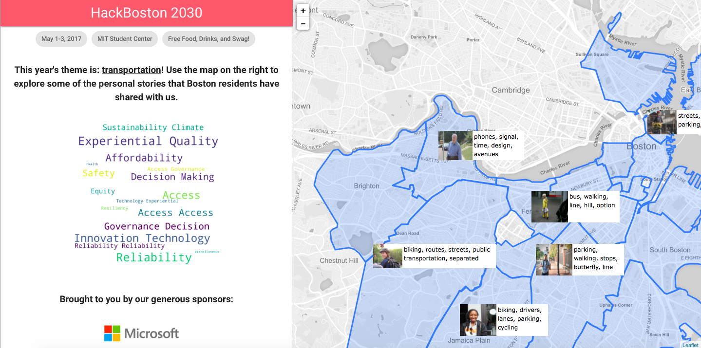
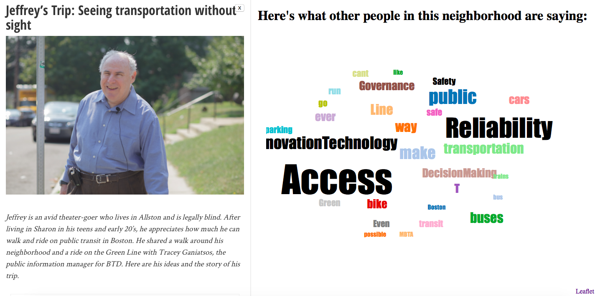

# The GoBoston Hackathon

Team: Kevin Zhang, Nina Mary Lutz, Jingxian Zhang

We looked at the GoBoston 2030 dataset and were intrigued by some of the ideas proposed by Boston
residents, which ranged from practical problem in transportation system like bus ticket price to innovative technologies like flying cars. With all these inspiring ideas and questions, suppose there is a GoBoston 2030 Civil Engineering Hackathon to encourage young innovators to explore future transportation in Boston. To attract participants and help them explore the GoBoston questions as well as contribute more ideas, we decide to build an website visualizing what people from different Boston regions focus on about future transportation. Our audience are young entrepreneurs and inventors in Boston, and our goal is to get them to join us at the GoBoston 2030 Civil Engineering Hackathon where we will build the future together.

Users will start their exploration by seeing some personal stories from people live in different regions in Boston about their future demand in transportation. When entering the interface, users can see a map of Boston with photos and keywords in different regions representing people and their stories (Figure 1). By clicking a photo, users will be able to read more about the story and see a word cloud about what else of future transportation people in this region pay attention to (Figure 2). The word cloud is generated from the questions related to this region in GoBoston 2030 dataset. Users can also click a keyword in the word cloud to see questions containing the keyword or under a specific theme (if the keyword is a theme name).

By presenting photos and personal stories, we wish to draw users' attention to what people really need through vivid stories. When users' attention is drawn to one region, the word cloud can serve as a port to support future exploration about other ideas related to this region.

