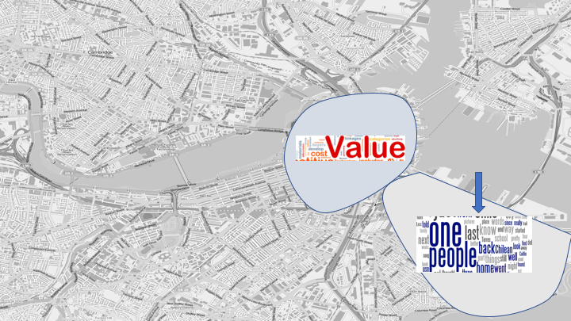
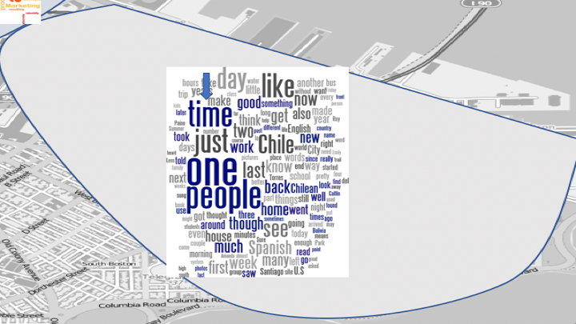
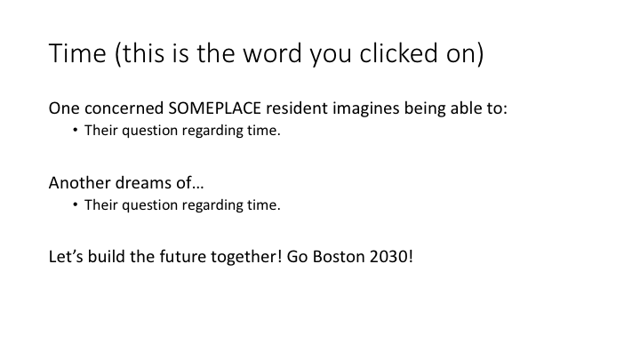

# cms631-personal-story
Our idea is to try and tell the hopes and dreams of Boston residents through their questions. This
sketch looks at questions related to the theme of innovation and technology, allowing you to see 
the most common dreams in each region and then drill down to the individual, personal level.

Innovators of Boston, are you paying attention? This is the future we - the people of Boston - want 
you to build.

## mockup
Default view - mini word maps for each region.

Narrow in on a specific region.

Click on a word and see individual hopes and dream.s

